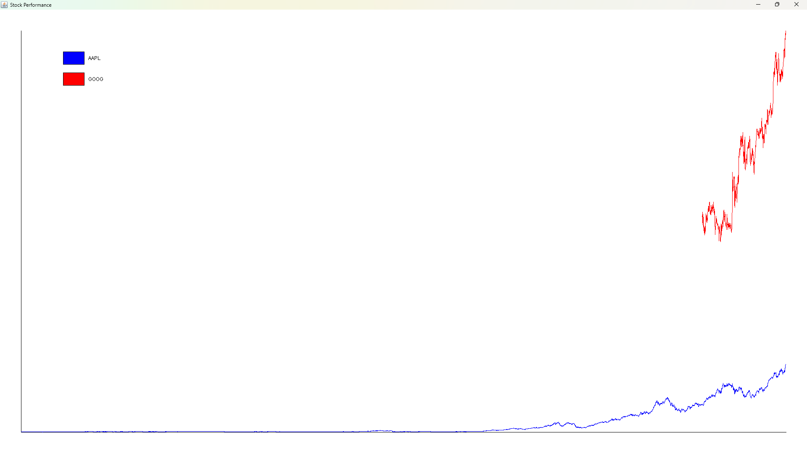

# Lab 9 - Loading Web Data

CSCI 2020U: Software Systems Development and Integration

## Overview
In this lab, you will write a program to download stock prices from the web and draw a line chart comparing two stocks.

## Tasks
- No template code is given. You can use code from previous labs to give you a starting point. Start with an empty JFrame containing a JPanel.
- Write a function, `downloadStockPrices()`
  - This function takes a stock ticker symbol (e.g. GOOG) and downloads historical stock data about an organization.
  - The URL you will use will look like this:
    >https://raw.githubusercontent.com/OntarioTech-CS-program/w26-lab09-Stock-Datasets/refs/heads/main/data/goog.us.csv
  - Replace the URL ending with another stock ticker symbol for another stock (e.g. AAPL -> aapl.us.csv)
- Write a function, `plotLines()`:
  - This function takes two lists of floating point values, which are stock closing price values
  - Use 2D graphics to draw the x-axis and y-axis 50 pixels from the left and bottom edge of the window
  - Call `plotLine()` twice, once for each stock
- Write a function, `plotLine()`:
  - Use 2D graphics to draw lines between each closing price
  - Not all stock data starts on the same date. Make sure the line starts correctly if it starts at a later date (look at figure). You can assume every last closing price has the same date.
  >Note: You’ll need to adjust for the size of the window, the 50-pixel pad around the outside, and the inverted y-axis
- Write some code to call the above functions to generate a graph similar to that shown in
  the figure (you can hard code the stock symbols, but I would recommend you try out a few different
  stocks for thorough testing)
- Add a legend to the graph. You can use the template code below to add your legend:
  ```java
  private void drawLegend(Graphics g2d, String[] labels, Color[] colours) {
      final int width = 50;
      final int height = 30;
      final int rowHeight = 50;
      final int x = 150;
      int y = 100;

      for (int i = 0; i < colours.length; i++) {
          g2d.setColor(colours[i]);
          g2d.fillRect(x, y, width, height);

          g2d.setColor(Color.BLACK);
          g2d.drawRect(x, y, width, height);

          g2d.drawString(labels[i], x + 60, y + 20);
          y += rowHeight;
      }
  }
  ```

<p align="center">
  
  The application’s sample output comparing Apple (AAPL: blue) and Google (GOOG: red)
</p>

>The auto grader will not check for correctness, this will be manually done.


## How to Submit and Grading

### Assignment Dropbox on Canvas (for each lab section)

- **Available from:** Opens **2 days before** the lab session at **12:00 AM**  
  - Example: If your lab is on **Monday**, the assignment becomes available on **Saturday at 12:00 AM**.

- **Due:** **End of your respective lab section**  
  - Example: **12:30 PM** for an **11:10 AM–12:30 PM** lab.

- **Available until:** **Start of the next lab session**  
  - Example: **11:10 AM** for an **11:10 AM–12:30 PM** lab.

---

## Grading (In-Person Only)

### On Time (by the end of your lab section)

1. Submit your **assignment URL** to Canvas.
2. Show your **completed lab assignment** to your lab TA for grading.

### Late (finished after the end of the lab session)

1. Submit your **assignment URL** to Canvas.
2. **Do not make changes** to your repository between your **last commit** and your **next lab**.  
   - Any commits made **after the Dropbox deadline** will **invalidate your submission** and your grade will be **0 (zero)**.
3. Come to your **next lab session** and:
   - Show your TA the output from `git status` for your repository (this proves you didn’t make changes after the Dropbox deadline).
   - Show your **completed lab assignment** to your lab TA for grading.
